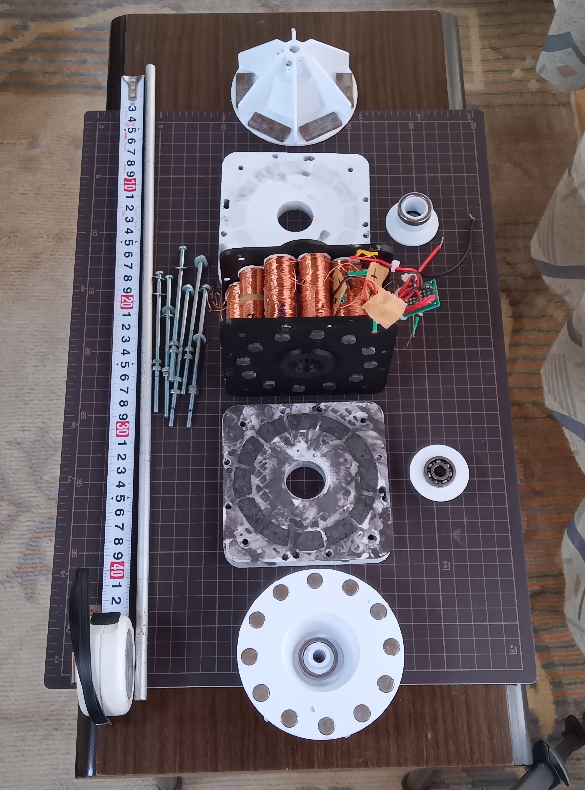

# マイクロ風力発電機

非常時にスマホや12V機器を充電できる発電機の実用化を目指しました

条件としては、個人でも実験できる範囲で家庭用扇風機の「強」の風でも発電するものです

# 構想

## 普段はベランダで垂直軸風車として発電し、バッテリーに充電

- 風向きに依存しない
- 低風速でも回転しやすい
- 常時ゆっくり充電しておく

## 非常時には簡単に持ち運べる大きさ、重さ

- 台風の時には風の当たらないところへ移動

## 水平軸風車、手回し用ハンドルに交換可能

- 扇風機の風でも回るほどの軽い回転トルク
- ギヤ比10:1の手回しでも問題なし
- 風力、手回しのどちらでも使用可能

# 発電機の構造

- 本試作品はアキシャルギャップ型の単相交流発電機
- コイル12個を直列に結線
- Φ10フェライトロッドをコアに使用
- 磁石背面をヨークで接続し、漏れ磁束を大幅に低減
- コギング抑制板を追加し、コアレスに近い回転を実現
- リング状ネオジム磁石の反発力で磁石とコギング抑制板の隙間を一定に保つ
- 個人でも入手可能な材料（アンテナ用フェライトロッド、砂鉄、エポキシ樹脂）

大まかな構造

組み立て時

# 実験環境

- 風洞設備が無いので家庭用扇風機を使用
- プロペラは扇風機の大きさに合わせた（大きすぎても風が当たらない）
- 試作品の強度、精度が充分ではなくギャップが均一でない
- コギング抑制板は、フェライトロッドを粉砕したものをエポキシ樹脂固めたもので、透磁率は低い

試作品のWebページ:  
https://isotsurishi.github.io/MICRO-WIND-GENERATOR/

# 実験結果（Release9）

720r.p.m.（手回し）
- 最大出力：約0.3W（ネオジム磁石Φ10）

扇風機の「強」の風（LEDの点灯電圧と実測値より推定：1300～1500r.p.m.）
- 最大出力：約1W

整流+DC-DC後の実力出力
- 0.4～0.6W

垂直軸型でも実験はしましたが、発電量が大きくなかったため省略しました
- 垂直軸型は水平軸型の大体1/3くらいしか発電量は有りませんでした

# 実験結果から得られた知見
- ヨークの効果は大きい（出力が明確に向上）
- コアは飽和していない（電圧が抵抗に比例）
- ギャップのばらつきが性能を低下
- コギング抑制板は効果あり（ただし、透磁率不足）
- 内部抵抗が大きく、低負荷で電力が頭打ち
- 扇風機の風は安定しているが、プロペラの大きさに制限有り

# 実用化の可能性

## 今の大きさでできるとすれば

- LEDライト
- 小型バッテリーのゆっくり充電
- 手回し10:1で2～3W（ちょい足し充電）

## 今の大きさで難しいこと

- スマホの通常充電（5W）
- 12Vバッテリーへの本格充電（12V）

## 潜在能力は高いと感じています
小型ながら、構造的には大規模化に向いていると自負しています

- ヨークで磁束を閉じる構造は非常に効果的
- コギング抑制板でコアレスに近い軽さを実現
- 発電機の規模を大きく（直径、極数、磁石、回転数等）すれば、5～10W級の実用風力発電機も有望

# 改善すべき点

- ギャップの平行度を改善
- 高透磁率素材でコア、コギング抑制板の改善
- 多極化
- コイル抵抗の低減
- 屋外での評価
- プロペラを大きくする

# 磁性粉末の入手について

## コギング低減のため、以下の材料で実験したいと考えています

- ナノ結晶材粉末
- アモルファス金属粉末
- 積層用純鉄粉末
- パーマロイ系・ケイ素鋼系粉末

ですが、個人で少量入手することが難しく、大きな制約となっています

# ご支援・ご協力のお願い

材料の調達や加工方法について、無償で情報提供いただけると大変助かります

GitHub issuesにて連絡頂ければ幸いです

## 過去の実験

過去の実験内容はInstagramにも掲載しています
#マイクロ風力発電機　#モバイル風力発電機　#家庭用風力発電機　#自作発電機　

# Micro Wind Generator

This project aims to develop a small wind generator that can charge smartphones or 12V devices during emergencies.

The main requirement was that the generator must work within the range of experiments an individual can perform — specifically, it should generate power even with the “strong” setting of a household electric fan.

# Concept

## Normal use: vertical-axis wind turbine on a balcony

- Does not depend on wind direction
- Easy to rotate even at low wind speeds
- Slowly charges a battery continuously

## Portable during emergencies

- Can be moved to a safe place during typhoons
- Small and lightweight enough to carry

## Interchangeable with horizontal-axis blades or a hand-crank

- Very low rotational torque — spins even with a household fan
- Works with a 10:1 hand-crank gear ratio
- Can be used with wind or manual power

# Generator Structure

- Axial-flux, single-phase AC generator
- 12 coils connected in series
- Φ10 ferrite rods used as cores
- Magnetic yoke on the back of the magnets to reduce flux leakage
- Cogging-reduction plate added to achieve near-coreless rotation
- Axial gap maintained by repulsion between ring-shaped neodymium magnets
- All materials are easy to obtain (antenna ferrite rods, iron sand, epoxy resin)

Internal structure  

Assembled  

# Experimental Environment

- No wind tunnel — used a household electric fan
- Propeller size matched to the fan (too large and wind won’t hit it)
- Prototype has limited strength and precision, so the gap is not perfectly uniform
- Cogging-reduction plate is made from crushed ferrite rods mixed with epoxy, so permeability is low

Project page:  
https://isotsurishi.github.io/MICRO-WIND-GENERATOR/

# Experimental Results (Release 9)

### 720 rpm (hand-crank)
- Max output: approx. **0.3 W** (NdFeB Φ10)

### Household fan “strong” wind  
(estimated 1300–1500 rpm from LED voltage and measured data)
- Max output: approx. **1 W**

### After rectifier + DC-DC converter
- Usable output: **0.4–0.6 W**

### Vertical-axis test
- Tested, but output was low, so omitted  
- Vertical-axis output was roughly **1/3** of the horizontal-axis version

# Findings from Experiments

- Yoke is highly effective (clear increase in output)
- Core is not saturated (voltage proportional to load resistance)
- Gap unevenness reduces performance
- Cogging-reduction plate works, but permeability is insufficient
- Internal resistance is high, limiting power at low loads
- Fan wind is stable, but propeller size is restricted

# Practical Possibilities

## What is feasible at the current size

- LED lighting
- Slow charging of small batteries
- 2–3 W with 10:1 hand-crank (useful for “quick top-up” charging)

## What is difficult at the current size

- Normal smartphone charging (5 W)
- Proper charging of 12V batteries

## Potential for scaling up

Although small, the structure is well-suited for scaling up.

- Yoke-based flux-closing structure is very effective
- Cogging-reduction plate enables near-coreless rotation
- Increasing diameter, pole count, magnet size, or rpm could make **5–10 W class** wind generators realistic

# Areas for Improvement

- Improve parallelism of the air gap
- Use higher-permeability materials for cores and cogging-reduction plate
- Increase pole count
- Reduce coil resistance
- Outdoor testing
- Larger propeller

# About Magnetic Powders

To further reduce cogging, I would like to experiment with:

- Nanocrystalline powder
- Amorphous metal powder
- Pure iron powder for lamination
- Permalloy / silicon-steel powders

However, obtaining small quantities as an individual is difficult and is currently a major limitation.

# Request for Support

If you can provide information about materials or processing methods, even non-commercially, it would be greatly appreciated.

Please contact me via GitHub Issues.

# Past Experiments

Past experiments are also posted on Instagram.  
#マイクロ風力発電機　#モバイル風力発電機　#家庭用風力発電機　#自作発電機　
