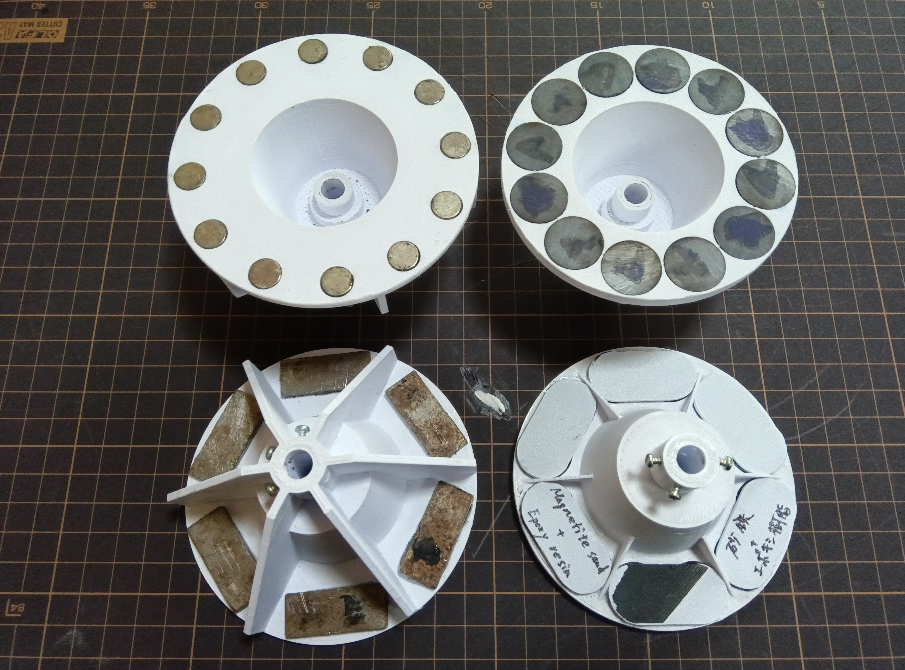

# マイクロ風力発電機

家庭用扇風機の風でも発電できる、小型風力（手回し）発電機の試作と実験記録  

---

## コア有りアキシャルギャップ型

個人開発としては少し挑戦的かもしれませんが、実用的なマイクロ発電機の実現を目指して研究を進めています。  
この発電機は 12 個のコイルを使用した単相交流発電機で、家庭用扇風機のような弱い風でも発電できるよう、コギングトルクの低減に取り組んでいます。

現在は、コイルのコア材やコギング抑制用の磁性体プレートに適した材料を探していますが、個人で入手できる材料には限界があり、開発の大きな課題となっています。

🌐 [試作品のWebページを見る](https://isotsurishi.github.io/MICRO-WIND-GENERATOR/)

---

## 発電機の構造

本試作品はアキシャルギャップ型のコアコイルを用いた単相交流発電機です。

- コアにはアンテナ用フェライトロッド（材質の詳細は不明）を使用  
- アキシャル方向の位置決めにリング状ネオジム磁石の反発を利用  
- コギング抑制のため、磁石とコイルの間に磁性体板を配置  
- 磁石背面からの漏れ磁束を防ぐため、隣接磁石を磁性体で連結  
- 負荷による逆起電力を抑えるため、全コイルを直列接続  

今回使用したフェライトロッドは透磁率は良いものの磁気飽和しやすく、コギングが残る原因になったと考えています。  
実用化する場合は、一度バッテリーに充電してから出力する方式が適していると判断しています。

---

## 磁性体粉末の入手について

現在、コギングトルクをどこまで低減できるか検証するために、**粒径の揃った磁性体粉末**を用いた実験を行いたいと考えています。  
しかし、個人で少量入手することが非常に難しく、プロジェクトの進行に大きな制約となっています。

実験してみたい粉末材料は次の通りです。

- ナノ結晶材粉末（高透磁率・低損失・高飽和磁束密度）  
- アモルファス金属粉末  
- 積層用純鉄粉末  
- パーマロイ系、ケイ素鋼系などの軟磁性粉末  

実験してみたかった材料の入手がかなわなかったので、再度、アンテナ用のフェライトロッドを通販で発注
コギング抑制板の容積を増やしてコギングが更に減るか実験

フェライトロッドを砕いてエポキシ樹脂で固めた材料の抵抗を測定すると測定位置にもよりますが、２～７MΩの導体となっていました

## フェライト磁石を使った場合の発電量を検証予定

ｖ4.0の実験結果よりコアが磁気飽和、若しくはそれに近い状態になっていると推量 

そこで、現行のネオジム磁石Φ10t3をフェライト磁石Φ18t5に変更、コアが飽和、若しくはそれに近い状態になっていたのかを検証するとともに、フェライト磁石の可能性を検証する予定 

磁石、プロペラ以外は全て同じ条件とする

現在使用しているネオジム磁石（Φ10×t3）を、フェライト磁石（Φ18×t5）に変更し、発電性能の違いを比較検証する予定
以下は、両者の磁束密度および磁束量の目安を比較した表です。

### 🔍 磁石の比較（ネオジム vs フェライト）

v6.0の結果より、扇風機の風でも電力をあまり使わないものであれば使えそうに感じましたが、さらに踏み込んだ検証をしてみたいです

しかし、コア、コギング抑制板の調達ができません

プロペラも私が作ったものではなく、効率の良いものを使ってみたいです

ホームページにも記載しましたが、材料の調達が叶わないと次の検証はできません

残念ではありますが、暫くは何か良い方法が有るか検討します

### 🔍 磁石の変更に伴い垂直軸型プロペラも変更

### 🔍 磁石の変更に伴い水平軸型プロペラも変更

## ご支援・ご協力のお願い

このプロジェクトは個人で開発・検証を行っています。  
材料の調達や加工方法など、情報提供やアドバイスをいただけるととても助かります。  
GitHubのIssueなどで、お気軽にご連絡ください！

---
# MICRO-WIND-GENERATOR

A compact axial-gap generator prototype designed for low-wind environments, including household fans.

### Prototype Overview: Core-Type Axial-Gap Generator

I might be taking on something a bit ambitious, but I’m exploring the idea of creating a practical micro‑generator as an individual developer.  
This generator uses 12 coils and produces single‑phase AC.  
I’m working on reducing cogging torque so it can generate power even with very weak airflow, like from a household fan.

Right now I’m searching for suitable magnetic materials for the coil cores and for the plates that help reduce cogging.  
However, there are real limits to what I can obtain or do on my own, and that’s becoming a challenge as I try to move this project forward.

🌐 [See the prototype webpage](https://isotsurishi.github.io/MICRO-WIND-GENERATOR/)

---

## Seeking Magnetic Powder Materials

To further evaluate how much cogging torque can be reduced, I would like to experiment with **magnetic powders with controlled particle size**, suitable for forming custom soft‑magnetic composite cores.

However, sourcing these materials in small quantities as an individual developer has been extremely challenging.

I’m looking for the following types of magnetic powders:

- Nanocrystalline powder (high μr, low loss, high Bs)  
- Amorphous metal powder  
- Pure iron powder (lamination‑grade)  
- Other soft‑magnetic powders such as permalloy or silicon‑steel based materials  

Due to difficulties obtaining the material I originally wanted to test, I reordered ferrite rods for antennas online. I'm also experimenting to see if increasing the volume of the cogging suppression plates will further reduce cogging.

### 🔍 Comparison of Magnets (Neodymium vs Ferrite)
Based on the results from version 6.0, it seems that if the device doesn’t consume much power, it could potentially run even with the airflow from a household fan. I’d like to take the testing a step further, but I’m unable to procure the cores or the cogging‑reduction plates.

I also want to try using a more efficient propeller instead of the one I made myself.

As I mentioned on my website, without being able to obtain the necessary materials, I can’t proceed with the next round of testing.

It’s disappointing, but for now I’ll take some time to think about whether there’s a good workaround.

### 🔍 Magnet Comparison: Neodymium vs Ferrite

### 🔍 Vertical-Axis Propeller Updated with Magnet Change

### 🔍 Horizontal-Axis Propeller Updated with Magnet Change

## Request for Support and Collaboration
This project is being developed and tested independently.
Any information, advice, or suggestions regarding material sourcing or processing methods would be greatly appreciated.
Feel free to contact me via GitHub Issues!

---

---

過去の実験の様子は Instagram にも掲載しています。  
#モバイル風力発電機 #風力発電機プロトタイプ #家庭用風力発電機

You can also find past experiments on Instagram:  
#MicroWindGenerator #WindTurbinePrototype #DIYWindPower

注意：英文は翻訳機にて翻訳したもので、日本語の文章と全く同じではない可能性が有ります

Note: The English text above was translated using a translation tool and may not exactly match the original Japanese.